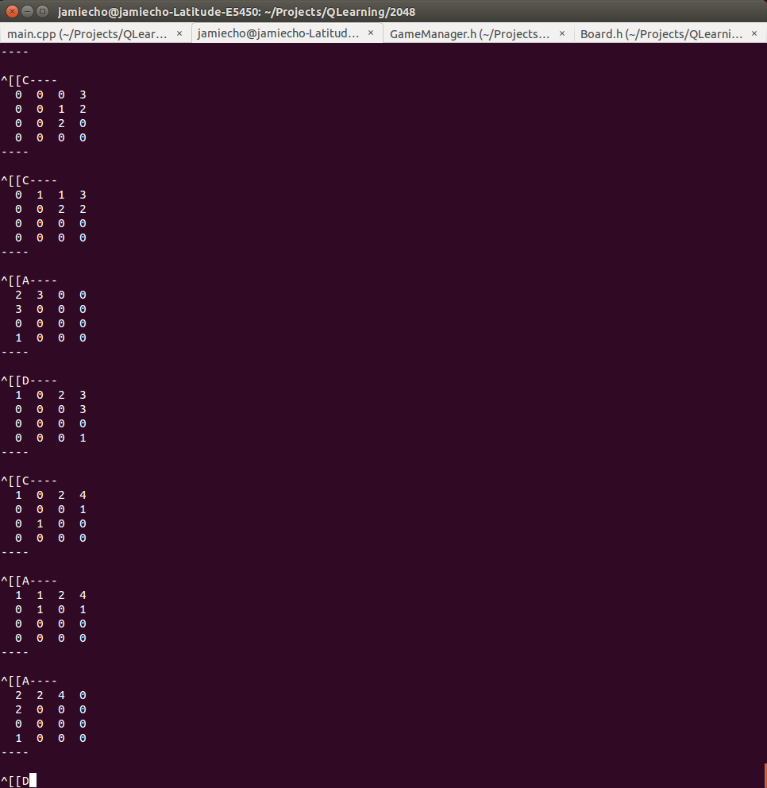
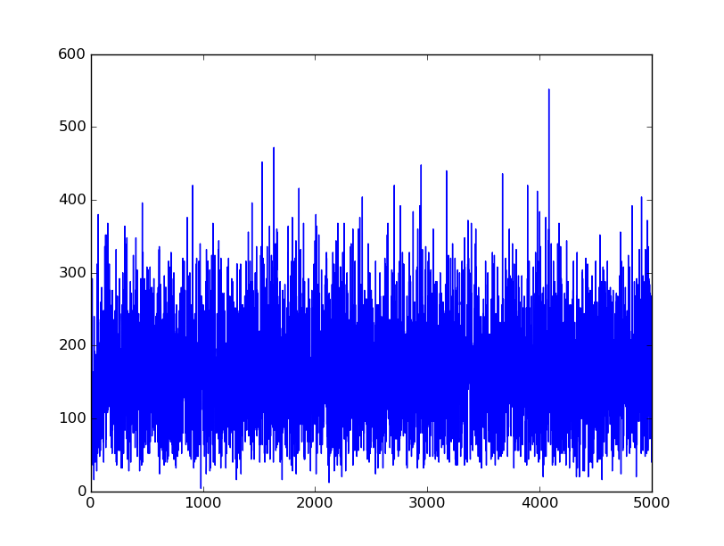

#2048 AI
---
## Description
Actions:
- left/right/down/up

States:
n\*m (i.e. 16 for 4X4 grid)

Parameters:
- Learning Rate for Network
- Learning Rate for SARSA (alpha)
- Discount Rate (gamma)
- Network Topology (# of Neurons and Hidden Layers)
- max # of epoch
- Frequency of Random Selection (epsilon)
---
## Progress

- [x] Board Complete
- [x] Game Logic Complete (for verification)
- [x] Q-Learning Agent Implementation -- faulty
- [ ] Experience Replay
- [ ] ConvNet (if needed)
- [x] SARSA or Off-Policy Q-Learning? -- SARSA
- [ ] SIGINT Handling
- [ ] Save/Load Trained Network
- [x] Debugging Premature Capping Problem
- [x] Better Determination of Terminal State
- [x] ~~Replace Deterministic Max Q-Value Exploration with Probabilistic Exploration~~ -- Unnecessary
- [ ] Debug Neural Network : Back Propagation Doesn't seem to occur effectively.

---
## Notes

At this point, I will implement the Agent using a Deep Neural Network
with a simple multilayer construct.
If that doesn't suffice, I will implement the Agent with a Convolutional Network.
Given that the state space is anticipated to be enormous, it is impractical to use a Q-table.

---

Currently, does not seem to be learning:

