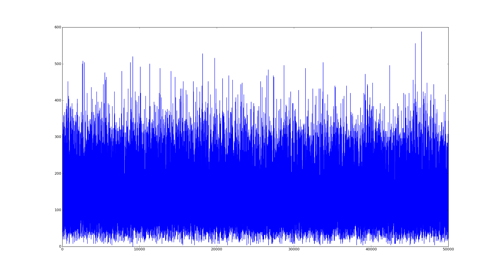
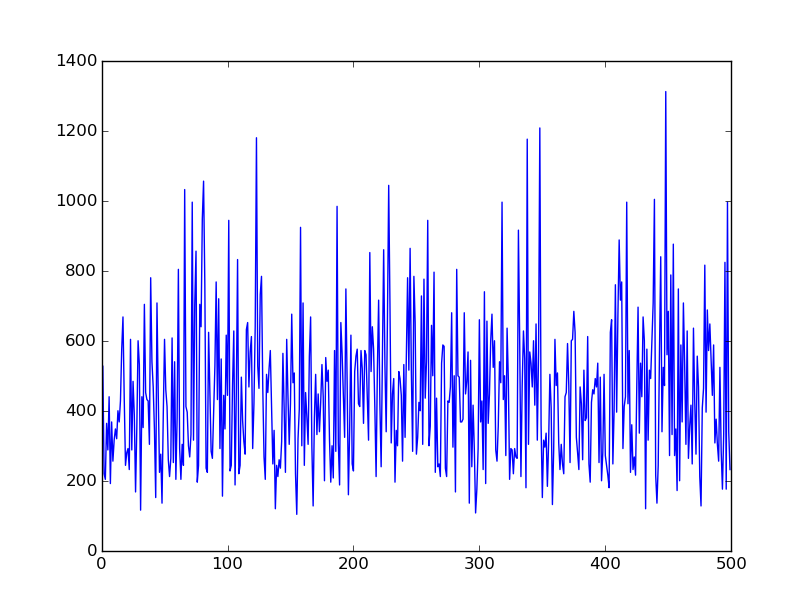
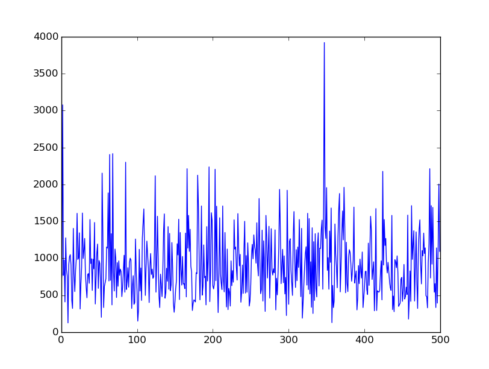
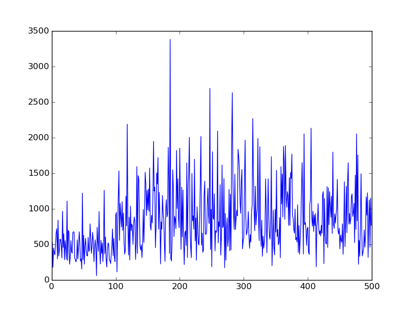
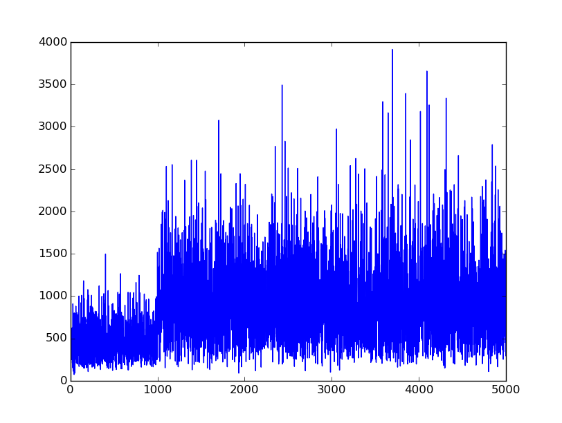

#2048 AI
---
## Description
**Actions:**
- left/right/down/up

**States:**
n\*m (i.e. 16 for 4X4 grid)

**Parameters:**
- Network:
	- Topology(#layers,neurons), @ Agent.h
	- Learning Rate, @ Agent.h
	- Weight Decay, @ Agent.h
- SARSA:
	- Learning Rate(alpha), @ GameManager.h
	- Discount Rate for future rewards(gamma) @ GameManager.h
	- Random Selection Rate(epsilon) @ Agent.h
- #Epoch
	- Command Line
- Normalizing reward
	- Normalization: @ GameManager.h
		- r /= 2048.0
		- r /= maxR
		- r = 1 - 1/r
	- Terminal State: @ GameManager.h
		- -1
		- 0

## Progress

- [x] Board Complete
- [x] Game Logic Complete (for verification)
- [x] Q-Learning Agent Implementation -- faulty
- [x] Experience Replay
- [ ] ConvNet (if needed)
- [x] SARSA or Off-Policy Q-Learning? --> Hybrid(Initially random-exploration, going off to SARSA)
- [ ] SIGINT Handling to stop training & view result
- [ ] Save/Load Trained Network
- [x] Debugging Premature Capping Problem
- [x] Better Determination of Terminal State
- [x] ~~Replace Deterministic Max Q-Value Exploration with Probabilistic Exploration~~
	- Unnecessary
- [x] Debug Neural Network : Back Propagation Doesn't seem to occur effectively.
	- Neural Network seems to be doing fine, simply a numerical instability for small numbers.
- [x] ~~Fix Game Logic Bug : Jumping Across Blocks~~
	- Was Running Old Code
- [x] Converting vectors into templates (since they are fixed-size)
- [x] Change Neural Net to Output Q-value for 4 actions as outputs 
	- (i.e. Q(S) --(net)--> {Q(S,a1),Q(S,a2)...})

---
## Notes

At this point, I will implement the Agent using a Deep Neural Network
with a simple multilayer construct.
If that doesn't suffice, I will implement the Agent with a Convolutional Network.
Given that the state space is anticipated to be enormous, it is impractical to use a Q-table.

I speculate that the Net doesn't learn very well because the changes in reward that occur due to a "better" move is very small (in the order of 1e-2); a better normalization scheme would be necessary. But how?

---

Currently, does not seem to be learning;

Scores over time on 3x3 Grid with 50000 iterations:

However, the agent does much better than a random agent:

Completely Random Agent:

Completely "Optimal" Agent:

Hybrid Agent: (random until 100)

Hybrid Agent #2: (random until 1000)

